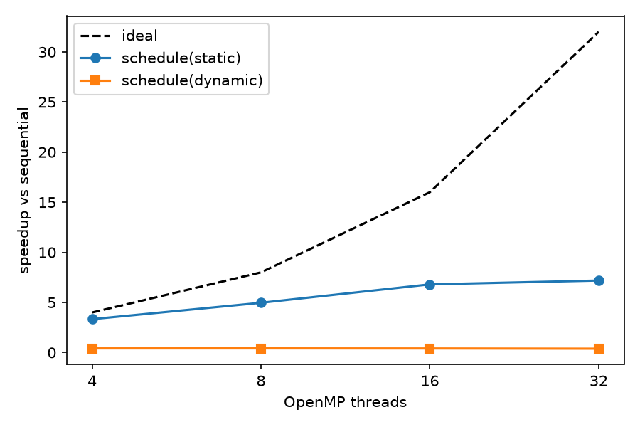
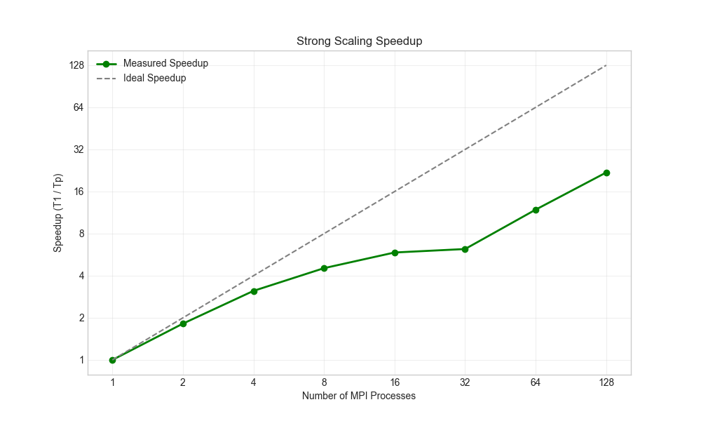

# kmeans-spmv

Two parallel kernels in C++ and their measurements:

- **K-means with OpenMP**: shared-memory K-means on 20,000 2-D points (K = 20), comparing `schedule(static)` and `schedule(dynamic)`.
- **Sparse matrix-vector multiply with MPI**: distributed-memory SpMV on the SuiteSparse matrix `nlpkkt240` (27,993,600 rows), with rows split so each rank gets about the same number of nonzeros.

This was a graded course assignment for Introduction to Scalable Systems (DS221), M.Tech CDS, IISc, 2025.

## Results

### K-means, OpenMP (one node, 30 runs per configuration)

Source: [`results/kmeans_output_8094.txt`](results/kmeans_output_8094.txt), summarised with `OpenMP/analysis.py`.

| Threads | static (ms) | speedup | efficiency | dynamic (ms) | speedup |
|---:|---:|---:|---:|---:|---:|
| 1 (sequential) | 25.0625 | 1.00x | 1.00 | | |
| 4 | 7.5199 | 3.33x | 0.83 | 60.9832 | 0.41x |
| 8 | 5.0475 | 4.97x | 0.62 | 60.6438 | 0.41x |
| 16 | 3.6842 | 6.80x | 0.43 | 61.8889 | 0.40x |
| 32 | **3.4876** | **7.19x** | 0.22 | 65.4441 | 0.38x |

`schedule(dynamic)` with the default chunk size of 1 is slower than the sequential code at every thread count. Each of the 20,000 points becomes its own scheduling event, and that overhead outweighs the 20 distance computations done per point.



### SpMV, MPI (`nlpkkt240`, 4 nodes, 128 tasks allocated, 5 runs per P)

Source: [`MPI/outputs/spmv_performance_metrics.csv`](MPI/outputs/spmv_performance_metrics.csv), recomputed from the raw logs in [`MPI/outputs/logs/`](MPI/outputs/logs) by `MPI/outputs/check_metrics.py`. Time is the slowest rank's time in the multiply loop (mean of 5 runs). Load imbalance is (max - min) / min over the ranks.

| P | max rank time (s) | speedup | efficiency | load imbalance |
|---:|---:|---:|---:|---:|
| 1 | 0.36750 | 1.00x | 1.00 | 0.000 |
| 2 | 0.20215 | 1.82x | 0.91 | 0.064 |
| 4 | 0.11789 | 3.12x | 0.78 | 0.097 |
| 8 | 0.08108 | 4.53x | 0.57 | 0.161 |
| 16 | 0.06264 | 5.87x | 0.37 | 0.221 |
| 32 | 0.05916 | 6.21x | 0.19 | 0.229 |
| 64 | 0.03094 | 11.88x | 0.19 | 0.346 |
| 128 | **0.01678** | **21.90x** | 0.17 | 0.483 |

All runs used vector size 27,993,600 (the `Vector loaded: size = 27993600` lines in the logs). The jobs requested `--nodes=4 --ntasks=128` (`MPI/run_experiments.sh`, `MPI/outputs/run_128_special.sh`). A separate attempt at P = 256 to 1024 (`run_extreme_cases.sh`) did not complete and is not reported.



## Approach

```
K-means (OpenMP)                        SpMV (MPI)
----------------                        ----------
init: first K points as centroids       rank 0 reads row_ptr, cuts rows so each
repeat until no change:                 rank gets ~nnz/P nonzeros
  parallel for over points  --------    MPI_Bcast(partition bounds)
    nearest centroid (K distances)        |
    per-thread sum_x/sum_y/count        each rank seeks into the binary file and
  reduction(+: arrays)                  reads only its rows (row_ptr, col_idx, values)
  serial: new centroids, check stop     every rank reads the full x vector
                                          |
                                        local CSR multiply  <-- timed (MPI_Wtime)
                                          |
                                        MPI_Reduce(min/max/sum time)
                                        MPI_Gatherv(y) to rank 0, print samples
```

- **K-means** (`OpenMP/kmeans_parallel.cpp`): the assignment step is the parallel loop. OpenMP array-section reductions (`reduction(+: sum_x[:K], sum_y[:K], count[:K])`) give each thread private accumulators, so there are no atomics and no shared writes in the hot loop. The centroid update and convergence test stay serial because they cost O(K).
- **SpMV** (`MPI/main_mpi.cpp`): the matrix is stored as binary CSR. Rows of this KKT matrix have different nonzero counts, so the split is by nonzero count rather than by row count. Each rank loads only its own slice of the file with `seekg`, so no rank ever holds the whole 9 GB matrix. `x` is replicated, which means the timed multiply needs no communication.
- `MPI/spmv_mpi.cpp` is an alternative where rank 0 loads everything and scatters it (`MPI_Scatterv`). It is not in the default build.

## Correctness checks

- **K-means:** `OpenMP/check_equivalence.sh` builds both programs and checks that the parallel version gives the same cluster sizes (exact) and centroids (to 1e-3) as the sequential one, for both schedules at 1, 2, 4 and 8 threads. All 8 cases pass with g++ 13.3. Cluster sizes in `cluster_outputs.csv` add up to 20,000 for every configuration.
- **SpMV:** each run prints y[0], y[n/2] and y[n-1]. They are identical for every process count from 1 to 128 (0.014195, 4.623217, -42.618965). This shows the nonzero-balanced partition and the gather do not change the result. `check_metrics.py` checks this, and also checks that every CSV row matches the raw logs.
- `scripts/mtx_to_bin.py` was round-trip tested on a small symmetric matrix that includes an explicitly stored zero.

## How to run

K-means (Linux, g++ with OpenMP):

```bash
cd OpenMP
make
./kmeans_sequential data_20k.csv 20
./kmeans_parallel   data_20k.csv 20 8 static
./check_equivalence.sh                       # correctness
REPEAT=30 ./run_experiments.sh 20 > ../results/kmeans_output_local.txt
python analysis.py ../results/kmeans_output_local.txt --plot-dir ../results
```

On a SLURM cluster, run `sbatch -p <partition> slurm_job.sh`.

SpMV (MPI C++ compiler, about 10 GB of disk and a large-memory node for the conversion):

```bash
scripts/fetch_matrix.sh                      # downloads nlpkkt240 and writes MPI/data/*.bin
cd MPI && make
mpiexec -np 8 ./spmv_mpi data/nlpkkt240_matrix.bin data/nlpkkt240_vector.bin
# or: SPMV_MATRIX=... SPMV_VECTOR=... sbatch -p <partition> run_experiments.sh
python outputs/check_metrics.py              # re-derive the CSV from the logs
```

Binary format: `int32 n, int32 nnz, int32 row_ptr[n+1], int32 col_idx[nnz], float64 values[nnz]`. The vector file is `int32 n, float64 x[n]`. The course runs used a pre-converted copy of `nlpkkt240` on the cluster. The converter writes an all-ones vector by default, so the printed y samples will not match the values above unless the original vector is used.

## Limitations

- SpMV time covers only the local multiply. File I/O, partitioning and the final `MPI_Gatherv` are not included, and `x` is fully replicated. That suits a strong-scaling study of the kernel, but it is not end-to-end time, and replicating `x` (224 MB per rank) would not scale to much larger problems. A halo exchange of only the needed `x` entries would.
- Efficiency falls to 0.17 at P = 128, and load imbalance rises to 0.48. The partition balances nonzero counts, not the actual memory traffic (irregular access into `x`), and ranks on the same node probably compete for memory bandwidth. Neither effect was profiled.
- The P = 1 baseline is the MPI program run on one rank, not a separately tuned serial code.
- K-means numbers come from one node with up to 32 hardware threads, on one dataset. The sequential run is only 25 ms, so fixed OpenMP overheads cap the speedup (efficiency 0.22 at 32 threads).
- K-means uses the first K points as initial centroids. That is deterministic, which makes the equivalence check possible, but it is not k-means++.
- The 9 GB matrix and the course's original vector file are not included. Use `scripts/fetch_matrix.sh` to regenerate the matrix.

## Layout

```
OpenMP/   kmeans_sequential.cpp, kmeans_parallel.cpp, makefile, run_experiments.sh,
          slurm_job.sh, analysis.py, check_equivalence.sh, data_20k.csv
MPI/      main_mpi.cpp, sparse_matrix.{h,cpp}, spmv_mpi.{h,cpp}, Makefile, run_experiments.sh
MPI/outputs/  run_128_special.sh, run_extreme_cases.sh, analyze_spmv.ipynb,
              spmv_performance_metrics.csv, logs/, check_metrics.py, plots
scripts/  fetch_matrix.sh, mtx_to_bin.py
results/  kmeans_output_8094.txt, K-means plots
```

## License

MIT, see [LICENSE](LICENSE).
